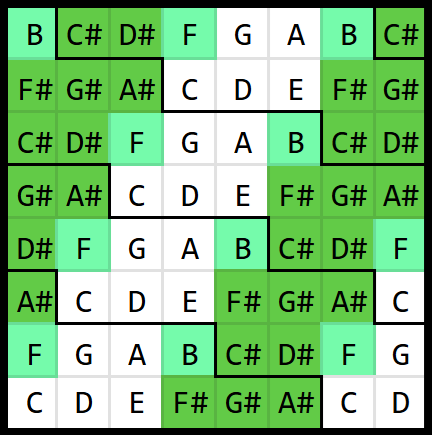
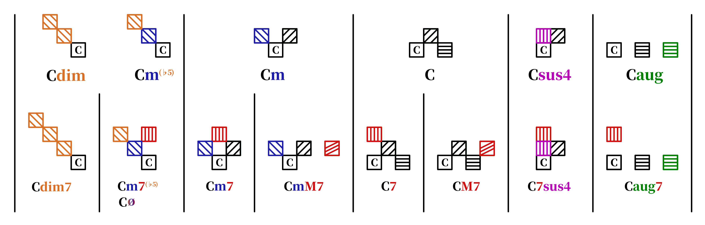
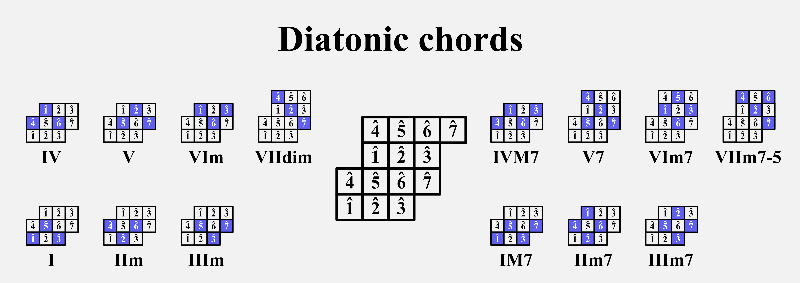
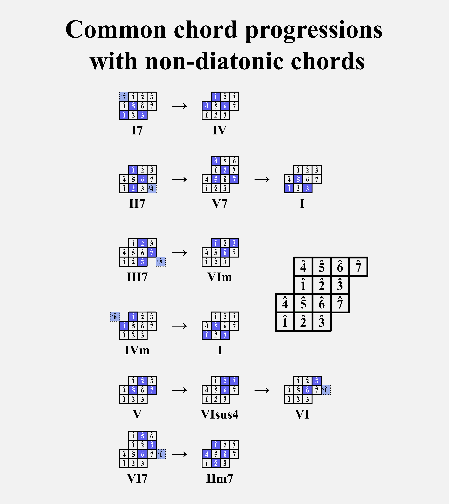

# WHiSq: Wicki–Hayden in Squares

A nice isomorphic keyboard layout easily realizable with a Launchpad Mini.

Those familiar with microtonal music may be interested in the √2 WHiSq, which is realizable on Launchpad Mini without changing the layout, but intended for 17edo. See [README-experts.md](./README-experts.md) for details.

## Layout

- up = 5 semitones (perfect fifth)
- left = 2 semitones (whole tone)

This means that the layout has **translational symmetry**. This means that, once you learn how to play a melody or a chord progression in one key, you can apply the **exact same** fingering patterns in different keys.

## How to set up

### Launchpad Mini

https://components.novationmusic.com/launchpad-mini-mk3/custom-modes/679509

[syx file](./WHiSq%20colorful.syx)

## Shapes of chords 

Thanks to the translational symmetry, chords of the same type have the same shape regardless of the key. For example, all major triads have the same shape, all minor triads have the same shape, and so on.

[PNG](./WHiSq_chord_cheatsheet.png) [SVG](./WHiSq_chord_cheatsheet.svg)

## Diatonic chords

You can learn a chord progression in one key and then apply the same fingering patterns to play the same chord progression in different keys. 

[PNG](./WHiSq_diatonic_chords.png) [SVG](./WHiSq_diatonic_chords.svg)

## Non-diatonic chord progressions

[PNG](./WHiSq_common_nondiatonic_progressions.png) [SVG](./WHiSq_common_nondiatonic_progressions.svg)

