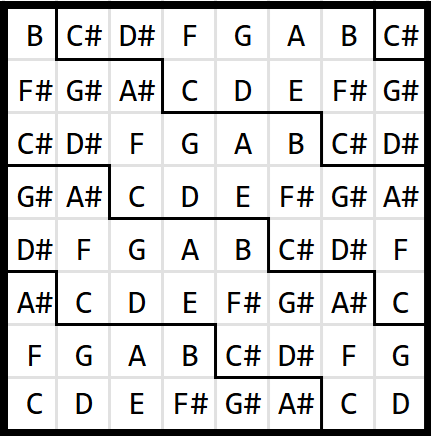

# WHiSq: Wicki–Hayden in Squares

An isomorphic keyboard layout easily realizable with a Launchpad Mini.

comes in two flavors: 

- plain WHiSq: intended for 12edo (12 equal temperament)  
- √2 WHiSq: intended for 17edo (17 equal temperament) 

## WHiSq: 12edo Wicki–Hayden in Squares; skip-fretting system 12 2 5

By configuring a rectangular grid to work as follows:

- up = 5 semitones (perfect fifth)
- left = 2 semitones (whole tone)

we arrive at a nice isomorphic keyboard.

https://components.novationmusic.com/launchpad-mini-mk3/custom-modes/683142

[syx file](./WHiSq%20monochrome.syx)

### colorful WHiSq

I like adopting the following color scheme in Launchpad Mini:

| pitch classes | rationale | color | RGB as shown in the Web interface |
|--|--|--|--|
| C, D, E, G, A | C Major Pentatonic | White | #ffffff |
| C#, D#, F#, G#, A# | black keys on a piano | Green | #62cb47 |
| F, B | belongs to neither of the two | Green_blue | #75fbab |

I also chose to set the “On colour” to Deep_blue.

https://components.novationmusic.com/launchpad-mini-mk3/custom-modes/679509

[syx file](./WHiSq%20colorful.syx)

### Chord cheatsheets

[PNG](./WHiSq_chord_cheatsheet.png) [SVG](./WHiSq_chord_cheatsheet.svg)

## √2 WHiSq: skip-fretting system 17 3 7

First, note how the just-intonation perfect fifth and the Pythagorean whole tone work in 12edo and 17edo:

|   | just-intonation P5 | Pythagorean WT |
|----|-------------------|---------------|
| ratio | 3/2 | 9/8 |
| [monzo](https://en.xen.wiki/w/Monzo) |  [-1 1⟩  |  [-3 2⟩ |
| 12edo |  5  | 2 |
| 17edo | 7 | 3 |

√2 WHiSq is based on the following observations:

- 5 + 2 = 7
- 5 - 2 = 3

That is, the two orthogonal diagonals of a Launchpad Mini configured in 12edo WHiSq can be taken as the new axes representing the P5 and the whole tone in 17edo.

Thus, rotating the board by 45 degrees and playing the grids reachable by bishop's moves results in a (mirrored) WHiSq: all you need to do is to multiply the spacings between your fingers by a factor of √2.

The fact that this is possible is quite amazing. It can partly be attributed to the fact that $(x, y) = (17, 12)$ is a solution to the Pell’s equation $x^2 - 2y^2 = 1$. To clarify a bit more, 

- $(1+2i)(2-5i) = 12 - i$ 
- $(1+2i)(1+i)(-2-5i) = 17 - i$

